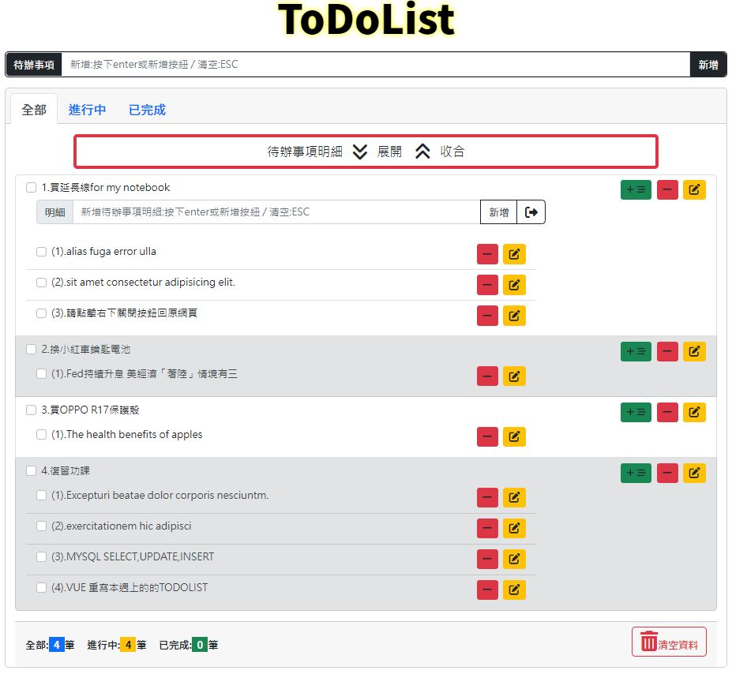

# 專題名稱:待辦事項/未完成/已完成即時分類
## 上傳日期:2023/3/28
## 作者:蘇麗雲 Sophia.liyun
## 使用技術: Bootstrap , JavaScript,VUE3(前端框架)
## 功能:
* CRUD待辦事項
* CRUD待辦事項明細
* 待辦事項明細的"收合"
* 待辦事項"已完成/未完成"即時分類

# 更新時程及內容
 |NO |PUSH DATE|TOPIC|CONTENT|
 |-----|--------|--------|----|
 |1|2023/3/28|首次上傳||
 |2|2023/3/30|修改README.md||
 |3|      |||
